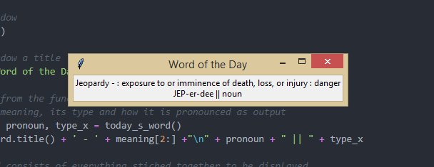
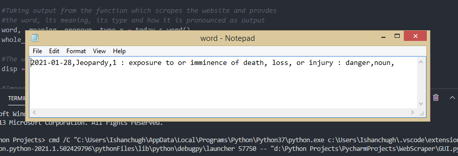

# merriam-webster-word-of-the-day
Want to learn new words everyday but don't want to search a website for it?
Just automate it.

For this project, I did some web scraping using BeautifulSoup.
Then, I have created a GUI using Tkinter and the words that are scraped everyday are stored in a .txt file in case you want to backtrack.

Libraries required-
1. Requests
2. BeautifulSoup

Note- Tkinter already comes preinstalled with Python 3.x

Steps?
Just download GUI.py and word_scraper.py in the same directory and run GUI.py

Here is a screenshot of the output.

Here is screenshot of the word.txt created (and updated everytime you run the GUI.py).

## Scheduling

If you wish to schedule this script to run everyday, there is a Scheduler.txt file included. Just edit the path in the file and save it as a .bat file.

Here is a link to help you further - https://datatofish.com/python-script-windows-scheduler/

Happy Learning!
