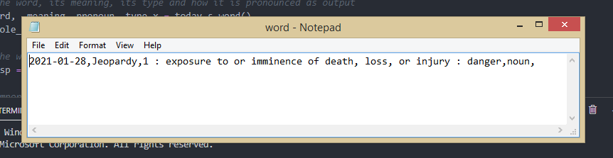

# Word Scaper
This project is a web scraper that scrapes the Merriam-Webster website for the word of the day.

Dependencies required-
1. Requests
2. BeautifulSoup

Tkinter already comes preinstalled with Python.

Steps - Clone the repository and run GUI.py

Here is a screenshot of the output.

Here is a screenshot of the word.txt created (and updated every time you run the GUI.py).

## Scheduling

If you wish to schedule this script to run every day, there is a Scheduler.txt file included.
Edit the path in the file and save it as a .bat file.

Here is a link to the scheduler configuration - https://datatofish.com/python-script-windows-scheduler/
